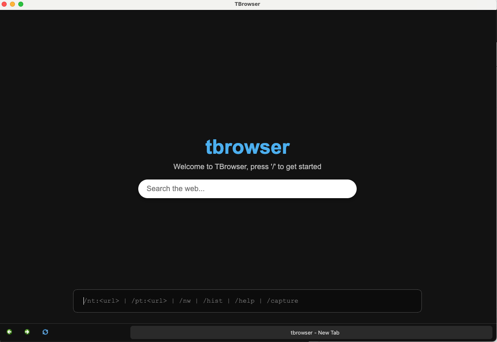

# Tbrowser

e.g., *A CLI Based web browser*

## Table of Contents
- [Overview](#overview)
- [Features](#features)
- [Getting Started](#getting-started)
  - [Installation](#installation)
  - [Running the App](#running-the-app)
- [Project Structure](#project-structure)
- [Configuration](#configuration)
- [Usage](#usage)
- [Contributing](#contributing)
- [License](#license)



---

## Overview
Making web browsing efficient by a superfast command palette, with option to create custom commands.

## Features
- Modular architecture with Python back-end and HTML front-end
- Support for command palette, shortcuts, custom utilities
- Easily packageable via `tbrowser.spec`

## Getting Started

### Installation  
```bash
git clone https://github.com/aryajpandey/tbrowser.git
cd tbrowser
# any setup steps like virtual environment, pip install
